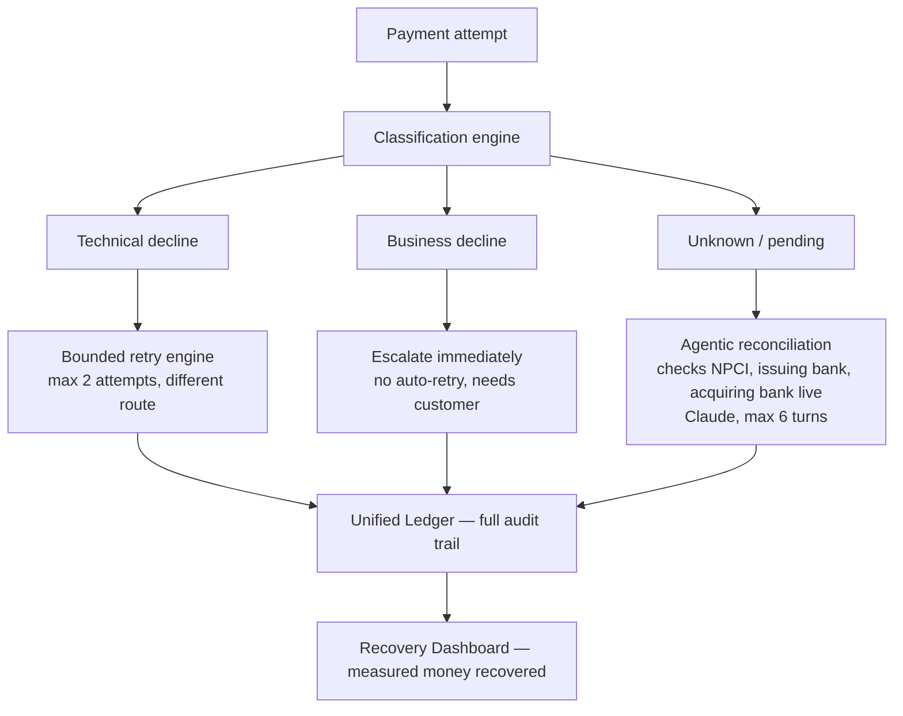

# Revenue Recovery Agent

An agent that detects revenue at risk in Indian payment flows, decides the right intervention, and executes a bounded recovery workflow - from payment failures to reconciliation and compliant escalation.

Built for the Razorpay AI Buildathon **Track 03: AI Revenue Recovery**.

## The problem

Not every payment failure is the same. Some need the customer to fix something (wrong PIN, insufficient balance). Some are transient system hiccups worth one smart retry (bank timeout, network drop). Some mean the money might already be debited, where retrying is dangerous, and the only safe move is to actually find out what happened.

Most systems treat all three as "Payment Failed" and stop there, leaving the customer with no real answer about their money, and silently losing revenue that was actually recoverable.

## What this agent does

1. **Classifies** every failed transaction into one of three lanes, based on its decline code.
2. **Technical declines** (bank timeout, network drop) get a bounded automatic retry through a different route - recovering the payment without any human involved, when possible.
3. **Business declines** (insufficient balance, wrong PIN) are never auto-retried - it needs the customer, so the system tells them clearly what to fix instead of wasting attempts.
4. **Ambiguous transactions** — where the confirmation never arrived, and it's unclear whether the money actually moved - go to a real LLM agent (Claude or Gemini). Instead of guessing, it **checks live with the payment network**: the issuing bank, NPCI, and the acquiring bank, in real time, to find out where the customer's money actually is. If it can recover the payment, it does. If it genuinely can't confirm yet, it's honest about that instead of faking an answer — it tells the customer their payment is under review and it'll follow up once the real settlement report confirms the outcome, rather than leaving them in silence.
5. Every transaction's full decision path lands in a **unified ledger** with a complete audit trail, and the dashboard shows **measured money recovered across a batch** - recovered, escalated, refunded, or pending confirmation, with nothing lost track of.

## Architecture



**Why only the `unknown/pending` path is agentic:** technical and business decline routing are solved lookups - a bank timeout should always route to bounded retry, a wrong PIN should never be auto-retried, and no reasoning changes that. The ambiguous path genuinely needs judgment (weighing what NPCI, the issuing bank, and the acquiring bank each say, in real time), so that's the piece built as a real tool-using agent instead of a fixed rule. Critically, the agent never pretends to have data it doesn't, a full settlement file is a batch record that doesn't exist yet moments after a transaction, so when live checks are inconclusive, the honest outcome is a fourth ledger state, **pending reconciliation**, with a commitment to update the customer once the real settlement data lands. See `ASSUMPTIONS.md` for the full reasoning and for exactly which numbers in this project are sourced vs. modeled.

## Quick start

```bash
cd backend
pip install -r requirements.txt
uvicorn main:app --reload
```

Then open `frontend/index.html` (the ops dashboard) or `frontend/checkout.html` (the customer-facing demo) directly in a browser. No API key required — the app runs on a deterministic offline fallback if none is set.

### Enable the real agent (optional but recommended)

Copy `backend/.env.example` to `backend/.env` and set one key:

```bash

# Claude (small paid credit balance — console.anthropic.com)
ANTHROPIC_API_KEY=your-key-here
```

 `ANTHROPIC_API_KEY` is used if present. Without it, the reconciliation path runs on a clearly labeled deterministic fallback instead of real LLM reasoning.

## Stopping rules (bounded recovery)

- Business declines are **never** auto-retried.
- Technical declines get **max 2** retry attempts, then escalate.
- The reconciliation agent gets **max 6** total turns and **max 3** diagnostic tool calls — it must finalize as one of `recovered`, `refunded`, `pending reconciliation`, or `escalated`, never left silently unresolved.
- Transactions that can't be confirmed within the compliance window are auto-refunded (RBI TAT-style rule), never left in limbo.

## Latest batch test results

From a live run against the real Claude-powered agent (800 simulated transactions):

| Metric | Value |
|---|---|
| Total attempted | ₹60,73,367 |
| Succeeded on first try | ₹54,02,595 |
| Addressable by the agent | ₹3,22,365 |
| **Recovered by the agent** | **₹2,11,004** |
| **Recovery rate (addressable)** | **65.46%** |
| Escalated (business decline + retry-exhausted) | ₹4,00,282 |
| Refunded (compliance TAT) | ₹59,486 |
| Unrecoverable by design (business declines) | ₹3,48,407 |

"Addressable by the agent" excludes business declines, since the system is deliberately built to never touch those — recovery rate is measured only against transactions the agent is actually designed to act on. See `ASSUMPTIONS.md` for exactly which figures above are grounded in research (NPCI's TD/BD framework, RBI TAT rules) versus modeled for this simulation.

## Project structure

```
backend/
  classifier.py       — reads decline code, routes to TD/BD/unknown
  retry_engine.py      — bounded retry/reroute for technical declines
  agentic_recon.py     — LLM-driven investigation for ambiguous cases
  agent_tools.py        — tools the agent uses to check NPCI/issuing/acquiring bank
  ledger.py             — unified transaction ledger + audit trail
  generator.py          — synthetic transaction generator for demos/batches
  main.py                — FastAPI orchestrator, all endpoints
frontend/
  index.html            — ops dashboard (batch runs, ledger, audit trail)
  checkout.html          — customer-facing checkout demo
```
